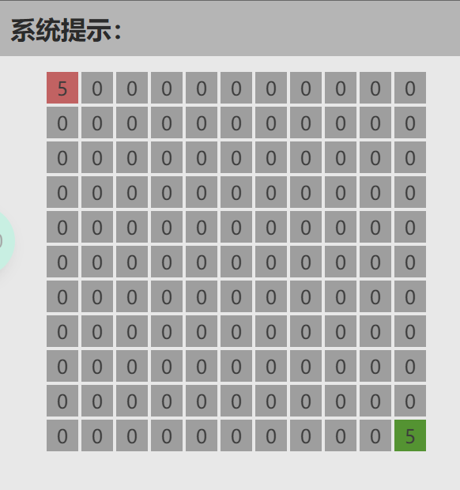
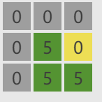

# 游戏规则

每个棋盘都是 10x10 的，如图所示：

每个格子都归属于红方、绿方或仍为公共区域（用灰色表示）。每个格子都有一个分数，标注于格子上。

左上角和右下角的格子分别属于红方和绿方，是他们的大本营，并拥有一个初始分数。

## 操作

### 占领

若一个公共的格子的周围有至少一个己方格子，则可以在这一回合，将其变成自己的格子，并设置初始分数。

（本文的“周围”指的是该格子的周围共 8 个格子）

### 回血

对于己方格子，可以在这一回合，使分数增加一定分数。周围的己方棋子数越多，越有可能加更多的分数。

大本营不能回血。

### 攻击

若一个对方格子的周围有至少一个己方格子，则可以在这一回合，使分数减少一定分数。周围的己方棋子数越多，越有可能加更多的分数。

被攻击的格子在下一个会合中不能被回血或攻击，在棋盘上标注为浅红色或浅绿色。

当分数减少为负时，该格子变为己方格子，并增加分数。

## 限制

### 不能围绕大本营

任何一方的棋子，无论是占领还是攻击得到的格子，都不能包围住大本营。

如图，右下角的格子是大本营。此时绿色棋子不能占领黄色的棋子，因为该棋子会包围住大本营。

### 不能和大本营断开连接

所有己方格子都必须和大本营连接，否则会被立刻清除为公共格子。
